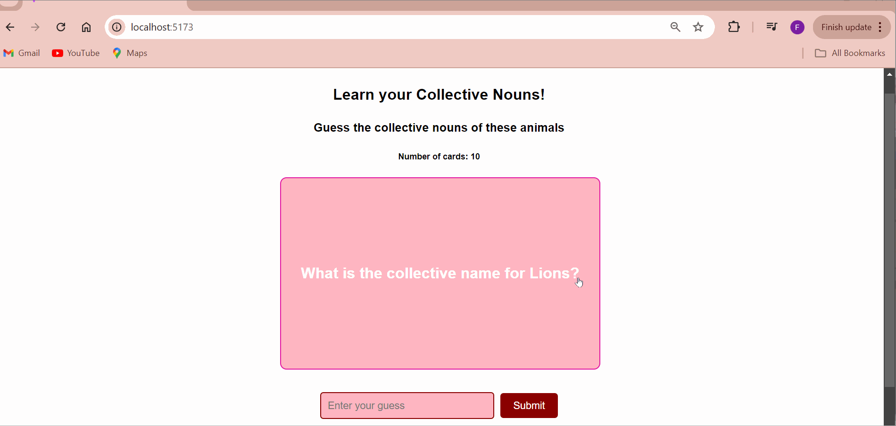

# Web Development Project 2 & 3- *Collective Noun FlashCards*

Submitted by: **Fatimah Badmos**

This web app: **contains flashcards that helps you learn collective nouns of animals.**

Time spent: **4** hours spent in total

## Required Features
The following **required** functionality is completed:

- [X] **The title of the card set and some information about it, such as a short description and the total number of cards are displayed**
- [X] **A single card at a time is displayed, only showing one of the components of the information pair**
- [X] **A list of card pairs is created**
- [X] **Clicking on the card shows the corresponding component of the information pair**
- [X] **Clicking the next button displays a random new card**

## Update for Project 3 Required Features
The following **required** functionality is completed:

- [X] **The user can enter their guess in a box before seeing the flipside of the card**
- [X] **Clicking on a submit button shows visual feedback about whether the answer was correct or incorrect**
- [X] **A back button is displayed on the card and can be used to return to the previous card in a set sequence**
- [X] **A next button is displayed on the card and can be used to navigate to the next card in a set sequence**

The following **optional** features are implemented:

- [ ] Cards contains images in addition to or in place of text
- [ ] Cards have different visual styles such as color based on their category
- [ ] *visual style implemented*

The following **additional** features are implemented:

* [ ] List anything else that you added to improve the site's functionality!

## Video Walkthrough

Here's a walkthrough of implemented required features:

<!---->

GIF created with LiceCap
